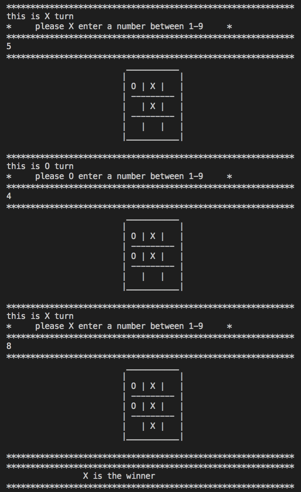
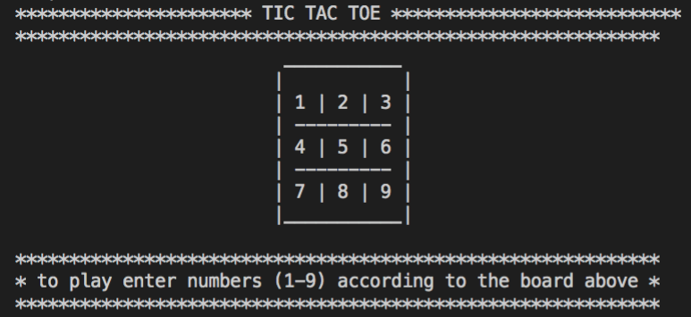

# Tic-Tac-Toe

> Tic-tac-toe is a Ruby project to demonstrate OOP design using Ruby by developing a playable tic-tac-toe game.

## Built With

- Ruby programming language, in accordance with the following principles:
    - OOP (Object Oriented Principles)
    - SRP (Single Responsibility Principle)

## GAME PLAY

Tic-tac-toe, or Xs and Os, is a game for two players who take turns marking the spaces in a 3×3 grid using an X or an O. The player who succeeds in placing three of their marks in a horizontal, vertical, or diagonal row is the winner. 

The following example game is won by the first player, X:

To get a local copy up and running follow these simple example steps:

### Prerequisites
    
    A computer running Windows, Linux or MacOS

### Setup

    # Windows

    Download and rub [RubyInstaller](https://rubyinstaller.org/)

    # Mac/Linux

    Open Terminal and type: install ruby

### Run

    Copy all the project files to a folder.

    Open Terminal and change directory to the project folder
    
    Type: main.rb or bin/main.rb

### To play

    Follow the instructions as per the images above.
    
    Enjoy!

    Close the Terminal window to close or exit once you finish a game. Repe

## Authors

👤 **Author1**

- Github: [@ricardo123321](https://github.com/ricardo123321)

👤 **Author2**

- Github: [@paulo-techie](https://github.com/paulo-techie)

## 🤝 Contributing

Contributions, issues and feature requests are welcome!

Feel free to check the [issues page](issues/).

## Show your support

Give a ⭐️ if you like this project!

## Acknowledgments

- Thanks to Microverse and the wonderful reviewers who have guided us to the completion of this project

## 📝 License

This project is [MIT](lic.url) licensed.
